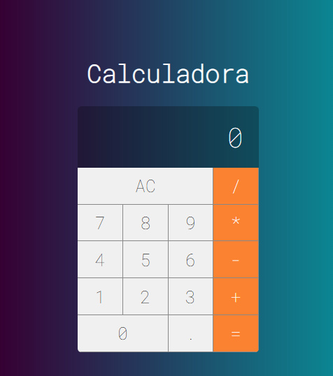

# Calculadora em React. 
## Projeto desenvolvido durante as aulas do curso de React-Redux da Cod3r.

Baixe o repositório do projeto e abra no editor de sua escolha.

Para executar primeiramente instale o nodeJs. O link da página de download se encontra [aqui](https://nodejs.org/en/)

Entrar no folder do projeto e executar no terminal o comando _npm i_ para instalar as dependências de projeto.

Digitar no terminal o comando _npm start_

Realizar seus cálculos, ser feliz e beber muita água!!! :smile:

### Screenshot

  
 

